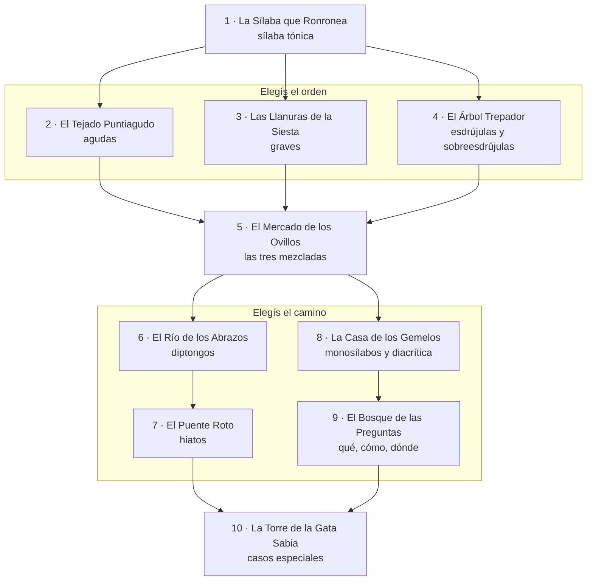
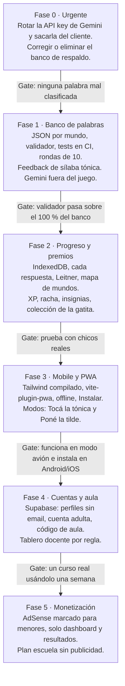

# Gatito Gramático — Análisis funcional y propuesta de mejora

Actualizado: 7 de octubre de 2026

## Resumen

El núcleo jugable funciona y la estética está bien encaminada, pero el contenido está mal: la IA y el banco de respaldo enseñan reglas equivocadas. Antes de agregar features hay que arreglar eso, porque un juego educativo que enseña mal es peor que no tenerlo.

- **Contenido:** 8 de las 25 palabras del banco de respaldo están mal clasificadas (ej. "mamá" como grave, "lápiz" como aguda). Tu intuición es correcta: banco JSON curado y validado, sin IA en runtime.
- **Seguridad:** la API key de Gemini queda embebida en el bundle (`dist/`). Si se publicó, hay que rotarla ya.
- **Usuarios:** el "login" es un email sin contraseña guardado en `localStorage`; no hay identidad real ni sincronización entre dispositivos.
- **Propuesta:** offline-first (IndexedDB) + sincronización opcional a backend; niveles por *regla* y no por número abstracto; repetición espaciada por palabra; premios atados a dominio, no solo a volumen; PWA y AdSense con reglas de contenido infantil.
- **Decisión clave pendiente:** el público son menores. Eso condiciona login, datos personales y ads (ver secciones 4 y 8).

## Qué hay hoy

Es una SPA en React 19 + Vite + TypeScript generada desde AI Studio, sin backend: todo vive en el navegador. Tiene 5 pantallas y un loop de juego de 20 palabras por ronda.

| Pieza | Qué hace | Archivo |
| --- | --- | --- |
| Auth | Registro con nombre + email, "login" solo con email, sin contraseña | `pages/Auth.tsx` |
| Dashboard | Saludo, 5 stats (nivel, rondas, efectividad, nivel promedio, medallas) y gráfico de las últimas 10 rondas | `pages/Dashboard.tsx` |
| Juego | 20 palabras; por cada una elegís tipo (aguda / grave / esdrújula) y si lleva tilde; 0,5 punto por acierto parcial; feedback + explicación | `pages/Game.tsx` |
| Práctica | Guía estática de las 3 reglas con ejemplos | `pages/Practice.tsx` |
| Logros | 8 medallas: Perfecto, Constante (5 rondas), Maestro Nivel 5–10 | `pages/Achievements.tsx` |
| Palabras | Gemini 2.5 Flash genera 20 palabras por ronda en un rango de dificultad; si falla, usa un banco fijo de 25 | `services/geminiService.ts` |
| Dificultad | Nivel 1–10; sube si la media móvil de 3 rondas es ≥ 80 %, baja si es < 50 % | `services/difficultyService.ts` |
| Persistencia | Usuarios y stats en `localStorage`; palabras recientes en `sessionStorage` | `services/hooks.ts` |
| Navegación | Router por hash casero; sidebar en desktop, bottom nav en mobile | `components/Layout.tsx` |

Lo bueno: el loop de dos decisiones (tipo + tilde) es pedagógicamente correcto, porque obliga a razonar la regla y no a adivinar la tilde. La gatita con estados de ánimo, los sonidos sintéticos y el layout que entra sin scroll en mobile son buena base.

## Problemas encontrados

El más grave es de contenido: el juego corrige al chico con respuestas incorrectas. Abajo, ordenados por impacto.

### Contenido mal clasificado (crítico)

El banco de respaldo (`FALLBACK_POOL`) tiene estos errores, y la IA comete los mismos con temperatura 1.1:

| Palabra | Dice el juego | Es en realidad |
| --- | --- | --- |
| mamá | Grave | Aguda terminada en vocal |
| lápiz | Aguda | Grave terminada en z |
| examen | Aguda "terminada en n" | Grave terminada en n, sin tilde |
| gramática | Grave | Esdrújula |
| agrícola | Grave | Esdrújula |
| idiosincrasia | Esdrújula "sin tilde gráfica" | Grave terminada en vocal |
| esternocleidomastoideo | Esdrújula "sin tilde" | Grave terminada en vocal |
| electroencefalografista | Esdrújula "sin tilde" | Grave terminada en vocal |

Además, las explicaciones "esdrújula sin tilde" contradicen la propia guía de Práctica ("siempre llevan tilde"). La dificultad también está mal modelada: "esternocleidomastoideo" es nivel 9 por ser larga, no porque la regla sea difícil. Para acentuación, la dificultad viene de la regla (hiato, diptongo, monosílabos), no del largo.

### Seguridad

- `vite.config.ts` inyecta `GEMINI_API_KEY` en el código cliente; el `dist/` actual la contiene en texto plano. Cualquiera que abra DevTools la usa con tu cuota.
- No hay contraseña: quien sepa el email de otro chico entra a su cuenta (en el mismo dispositivo).

### Arquitectura

- Todo el estado de todos los usuarios vive en una sola clave de `localStorage` (`gg_users`). Se pierde al limpiar el navegador y no viaja entre dispositivos.
- `handleGameEnd` muta `currentUser.stats` en el lugar (copia superficial); funciona de casualidad porque `normalizeUserStats` crea un objeto nuevo en cada render.
- Se guarda solo el resumen de la ronda, no cada respuesta. Sin eso no se puede saber *qué* regla falla el chico, que es el dato más valioso.
- Tailwind por CDN (`cdn.tailwindcss.com`): no apto para producción ni para PWA offline.
- Cero tests. Para un banco de palabras, un test que valide clasificación automáticamente es obligatorio.

### Pedagogía y diseño de juego

- La progresión es un número (1–10) que no significa nada para el chico. "Nivel 4" no dice qué aprendiste.
- Solo cubre agudas / graves / esdrújulas. Faltan hiato (*río*, *baúl*), monosílabos y tilde diacrítica (*tú/tu*, *más/mas*), que es donde están los errores reales en la escuela. El tipo `Sobreesdrújula` existe pero nunca se juega.
- 20 palabras por ronda es largo para mobile y para chicos chicos; la sesión ideal es 2–3 minutos.
- Una sola mecánica. Al tercer día aburre.
- Las medallas premian volumen y perfección, no progreso. Un chico que va de 40 % a 70 % no recibe nada.
- Feedback correcto pero pasivo: muestra la regla, no señala la sílaba tónica, que es el paso que el chico no ve.

## Usuarios y persistencia

No elijas entre storage y base de datos: usá los dos. IndexedDB local como fuente primaria (el juego anda offline y sin cuenta) y sincronización a backend cuando hay sesión. Para el backend recomiendo Supabase antes que Mongo.

### Por qué no Mongo (para este caso)

| Criterio | MongoDB Atlas | Supabase | Firebase |
| --- | --- | --- | --- |
| Auth incluida | No, la armás vos | Sí: anónima, magic link, Google | Sí |
| Necesita API propia | Sí (Node/Express o serverless) | No: SDK + reglas RLS | No |
| Datos de este juego | Documentos, sirve | Relacional, ideal para reportes (aciertos por regla, por curso) | Documentos, consultas agregadas incómodas |
| Plan gratis | 512 MB | 500 MB + auth | Generoso, pero lock-in |

Mongo sirve si ya tenés un backend Node que querés reutilizar. Si no, te obliga a escribir auth y API que Supabase te da hecho, y las consultas tipo "qué regla falla más este curso" son más naturales en SQL.

### Identidad: cuidado con los menores

Pedirle email a un chico de 9 años es un problema legal (Ley 25.326 de datos personales; COPPA si llega tráfico de EE. UU.) y práctico (no tienen email). Propuesta en tres capas:

1. **Jugador invitado:** entra sin nada, elige alias + avatar de gatito. Progreso en IndexedDB. Cero fricción.
2. **Cuenta adulta (padre o docente):** login con Google o magic link. Un adulto puede tener varios perfiles de chico debajo. Al vincular, el progreso del invitado se sube.
3. **Código de aula:** el docente crea un curso y comparte un código de 6 letras; el chico se une con alias + PIN de 4 dígitos. El docente ve el tablero del curso. Este es tu diferencial frente a otras apps de ortografía.

### Modelo de datos mínimo

| Tabla | Campos clave | Para qué |
| --- | --- | --- |
| `profiles` | id, alias, avatar, owner_id, classroom_id, rounds_played | El chico; nunca guarda email |
| `sessions` | profile_id, started_at, mode, rule_focus, score, xp | Una ronda |
| `attempts` | session_id, word_id, answer_type, answer_tilde, correct, ms | Cada respuesta: la base del tracking real |
| `word_mastery` | profile_id, word_id, box (0–5), due_round, last_seen_at, streak | Repetición espaciada |
| `rule_mastery` | profile_id, rule_id, accuracy_ema, unlocked | Progreso por regla, alimenta niveles |
| `rewards` | profile_id, reward_id, earned_at | Premios |

Sincronización: cola de `attempts` pendientes en IndexedDB que se sube en lote al terminar la ronda o al volver la conexión. Conflictos simples: los attempts son solo inserción, y las tablas de mastery se recalculan desde ellos.

## Banco de palabras y niveles

Sí al JSON curado, y con un paso más: un validador automático que separa en sílabas, ubica la tónica y verifica la regla de cada entrada. La acentuación del español es determinista, así que el código puede auditar al contenido; la IA queda solo como herramienta offline para proponer candidatas.

### Niveles = reglas, no números

Cada mundo enseña una regla y se desbloquea al dominar la anterior. El chico sabe qué está aprendiendo y el docente puede mapearlo al programa.

| Mundo | Regla | Ejemplos | Edad orientativa |
| --- | --- | --- | --- |
| 1. La sílaba que suena | Encontrar la sílaba tónica | ca-**MI**-sa, re-**LOJ** | 7–8 |
| 2. Agudas | Tilde si termina en n, s o vocal | café, camión, reloj | 8–9 |
| 3. Graves | Tilde si NO termina en n, s o vocal | árbol, lápiz, examen | 8–9 |
| 4. Esdrújulas y sobreesdrújulas | Siempre tilde | música, dígaselo | 9–10 |
| 5. Mezcla | Las tres juntas, palabras trampa | último / ultimo / ultimó | 9–10 |
| 6. Diptongos | Reglas generales con diptongo | camión, huésped, cuidado | 10–11 |
| 7. Hiatos | i/u tónica junto a vocal abierta | río, baúl, país, oír | 10–12 |
| 8. Monosílabos y diacrítica | Monosílabos sin tilde salvo diacrítica | tú/tu, él/el, más/mas, fue, dio | 10–12 |
| 9. Qué, cómo, dónde | Interrogativos y exclamativos (en frase) | ¿Qué querés? / Dijo que sí | 11–13 |
| 10. Casos especiales | Plurales que cambian, -mente, compuestos | examen → exámenes, fácilmente | 12+ |

Dentro de cada mundo hay 3 tiers de dificultad (1 = palabra frecuente y regla obvia; 3 = palabra poco común, terminación engañosa o par mínimo). Los mundos 8 y 9 necesitan la palabra dentro de una oración, porque sin contexto no hay respuesta.

### Formato de cada entrada

```json
{
  "id": "examen",
  "word": "examen",
  "syllables": ["e", "xa", "men"],
  "stressIndex": 1,
  "type": "grave",
  "hasTilde": false,
  "rule": "grave_n_s_vocal",
  "world": 3,
  "tier": 2,
  "distractor": "exámen",
  "sentence": null,
  "tags": ["escuela"],
  "freq": 4.2
}
```

- `syllables` + `stressIndex` permiten el feedback visual (resaltar la sílaba tónica) y nuevas mecánicas.
- `rule` es la clave para el tracking: el sistema sabe que el chico falla "graves terminadas en consonante", no "la palabra 37".
- `freq` (frecuencia de uso, ej. de un corpus) ordena las palabras fáciles primero.
- Un archivo por mundo (`words/world-03.json`), cargados bajo demanda y cacheados por el service worker.

### Cómo armar el banco

1. Partir de una lista de frecuencias del español y filtrar sustantivos, adjetivos y verbos aptos para chicos.
2. Generar candidatos con IA en lote (offline, no en el juego), pidiendo palabra + mundo.
3. Pasar todo por el validador: si la IA dice "grave" y el validador dice "aguda", la entrada se descarta o va a revisión.
4. Revisión humana rápida (vos, Rosalía o un docente) de las marcadas.
5. El validador corre como test en CI: nadie puede commitear una palabra mal clasificada.

Meta inicial: unas 80 palabras por mundo en mundos 2–5 (alcanza para semanas de juego con repetición espaciada); el resto puede llegar en una segunda tanda.

### El mapa de mundos

Los mundos se recorren como un mapa que el chico va desbloqueando, con dos bifurcaciones donde elige el orden. Cada mundo tiene un nombre y un lugar propios, atados a la regla que enseña, para que el nombre funcione como recordatorio de la regla.



Las bifurcaciones respetan qué regla necesita a cuál: agudas, graves y esdrújulas son independientes entre sí, pero el Mercado exige las tres. Los hiatos necesitan diptongos antes (se enseñan como "el diptongo que se rompe"), y los interrogativos necesitan la tilde diacrítica.

| Mundo | Por qué ese nombre | Gato amigo que se gana | Se desbloquea al vencer al jefe de |
| --- | --- | --- | --- |
| La Sílaba que Ronronea | La sílaba tónica es la que "ronronea" más fuerte | — (es el mundo inicial) | Abierto desde el inicio |
| El Tejado Puntiagudo | En la aguda la fuerza está en la punta, al final | Gato de tejado | La Sílaba que Ronronea |
| Las Llanuras de la Siesta | Grave también se llama llana; la fuerza descansa en la penúltima | Gato dormilón | La Sílaba que Ronronea |
| El Árbol Trepador | La fuerza queda lejos, arriba, hay que trepar hasta la antepenúltima | Gato trepador | La Sílaba que Ronronea |
| El Mercado de los Ovillos | Todo mezclado, como ovillos enredados | Gato mercader | Los tres mundos anteriores |
| El Río de los Abrazos | En el diptongo, dos vocales van abrazadas en la misma sílaba | Gato nadador | El Mercado de los Ovillos |
| El Puente Roto | En el hiato, el abrazo se rompe y las vocales se separan | Gato equilibrista | El Río de los Abrazos |
| La Casa de los Gemelos | Palabras gemelas que la tilde distingue: tú/tu, él/el, más/mas | Gatos gemelos | El Mercado de los Ovillos |
| El Bosque de las Preguntas | ¿Qué? ¿Cómo? ¿Dónde? llevan tilde cuando preguntan | Gato curioso | La Casa de los Gemelos |
| La Torre de la Gata Sabia | El final: plurales que cambian, -mente, compuestos | La Gata Sabia (corona para la gatita) | El Puente Roto y El Bosque de las Preguntas |

Cada mundo tiene 4 a 5 paradas en el mapa: lección corta, práctica tier 1, práctica tier 2, desafío tier 3 y un jefe final (una ronda mezclada). Solo vencer al jefe desbloquea el mundo siguiente (no alcanza con buena precisión) con animación y suma el gato amigo a la colección. Lo ya desbloqueado nunca se vuelve a bloquear, y con código de aula el docente puede abrir un mundo para todo el curso.

## Algoritmo adaptativo

El algoritmo actual ajusta un solo número por ronda. La propuesta mide dominio en tres niveles (palabra, regla, mundo) y arma cada ronda mezclando lo nuevo con lo que el chico falla, con repetición espaciada. Todo corre en el cliente, sin servidor.

### Qué se mide

- **Por palabra:** caja Leitner de 0 a 5. Acierto completo sube una caja; error vuelve a la caja 1. Cada caja tiene un intervalo medido en rondas jugadas por ese chico, no en días: caja 1 vuelve en la próxima ronda, caja 2 en 2 rondas, caja 3 en 4, caja 4 en 8 y caja 5 en 16. Al responder se guarda `due_round = rondas jugadas + intervalo`; la palabra vuelve a ser elegible cuando el chico alcanza esa ronda. Así el repaso avanza solo cuando juega: quien juega una vez por semana no se encuentra con todo vencido de golpe. Regla extra para las cajas 4 y 5: además de alcanzar su `due_round`, tiene que haber pasado al menos 1 día desde la última vez que la vio (`last_seen_at`). Así, cinco rondas seguidas en una tarde no queman el repaso de lo que ya domina.
- **Por regla:** precisión con media móvil exponencial (los últimos intentos pesan más), `ema = 0,8 × ema + 0,2 × acierto`.
- **Por mundo:** la única forma de pasar al mundo siguiente es vencer al jefe final. El dominio decide cuándo se habilita el jefe: todas las reglas del mundo por encima de 85 % de EMA con al menos 20 intentos. Si el chico pierde contra el jefe, sigue practicando y puede reintentar en la ronda siguiente. Esto reemplaza el "nivel 1–10".

### Cómo se arma una ronda de 10 palabras

| Cupo | Origen | Para qué |
| --- | --- | --- |
| 5 | Mundo actual, tier ajustado al rendimiento | Avanzar |
| 3 | Repasos vencidos (`due_round` ya alcanzado), priorizando errores recientes | Fijar lo aprendido |
| 1 | La regla más floja de mundos anteriores | Evitar que se olvide |
| 1 | Tier siguiente o mundo siguiente | Desafío, da el "¡uh, esta era difícil!" |

Si falta material en un cupo, se rellena con el mundo actual. Dentro de cada cupo, la palabra se elige al azar ponderado: peso = (1 + errores previos) × penalización si apareció en las últimas 2 rondas. Nunca la misma palabra dos veces en una ronda.

### Ajuste dentro de la ronda

- 3 errores seguidos: la próxima palabra baja un tier y la gatita da una pista (resalta la sílaba tónica antes de responder).
- 5 aciertos seguidos: entra una palabra de desafío extra con bonus de XP.

Esto mantiene al chico en la zona de éxito del 70–85 %, que es donde se aprende sin frustrarse. Al final de la ronda se muestra qué regla mejoró y cuál conviene repasar, no solo el puntaje.

## Premios y gamificación

Los premios tienen que recompensar aprender, no jugar mucho. Si premiás volumen, el chico juega rápido y mal; si premiás dominio y mejora, juega para entender. Propongo cuatro capas, de lo inmediato a lo coleccionable.

| Capa | Qué es | Cómo se gana | Por qué funciona |
| --- | --- | --- | --- |
| XP y estrellas | Puntos por ronda; 1–3 estrellas por mundo | Acierto completo 10 XP, parcial 4, bonus por racha y por desafío | Feedback inmediato |
| Racha diaria | Días seguidos jugando, con 1 "siesta de gato" por semana que la protege | Una ronda al día | Crea hábito sin castigar un día perdido |
| Colección de la gatita | Accesorios (moños, sombreros, anteojos), fondos y otros gatos amigos | Se compran con "croquetas" ganadas al dominar palabras (caja 3+) | Personalización = apego; la moneda sale de dominio real |
| Insignias | Logros con nombre y diseño | Ver lista abajo | Metas a mediano plazo |

### Insignias propuestas

- **De dominio:** "Cazadora de agudas" (mundo 2 a 3 estrellas), "Detective de hiatos", etc. Una por mundo.
- **De mejora:** "Remontada" (subir 20 puntos de precisión en una regla en una semana), "Ya no me engañan" (acertar 5 veces una palabra que fallaste 3 veces). Estas son las más importantes para chicos que arrancan mal.
- **De hábito:** rachas de 3, 7, 30 días.
- **Secretas:** jugar a medianoche, acertar "esternocleidomastoideo" (bien clasificada esta vez), etc. Generan conversación en el aula.

### Otras mecánicas para no aburrir

Con el banco con sílabas podés sumar modos sin contenido nuevo:

- **Tocá la tónica:** la palabra aparece separada en sílabas y el chico toca la que suena fuerte. Es el mundo 1 y el mejor feedback del resto.
- **Poné la tilde:** palabra sin tilde, tocás la vocal donde va (o "no lleva"). Más directo que el formulario actual.
- **Contrarreloj:** 60 segundos, solo palabras ya dominadas. Para repasar y para el ranking del aula.
- **Duelo de aula:** el docente lanza un desafío semanal y el curso compite como equipo, no individualmente (evita humillar al que va atrás).

## Mobile first, PWA y publicidad

El layout ya piensa en mobile; lo que falta es diseñar la sesión para el celular (corta, con el pulgar) y hacer la app instalable y offline. Los ads son viables, pero con las reglas de contenido infantil, que bajan el ingreso por impresión.

### Mobile first

- Rondas de 10 palabras (2–3 minutos), no 20.
- Todo lo que se toca en la mitad inferior de la pantalla (zona del pulgar); botones de 48 px o más.
- Una decisión por pantalla cuando se pueda ("Tocá la tónica" → "¿Lleva tilde?"), en vez de dos grupos de botones a la vez.
- Vibración corta al acertar o errar (`navigator.vibrate`), con opción de apagar sonido y vibración.
- Diseñar a 360 px de ancho y escalar hacia arriba; el sidebar de desktop pasa a ser un extra, no la base.

### PWA

1. Reemplazar Tailwind por CDN por Tailwind compilado con Vite (requisito para que funcione offline).
2. Sumar `vite-plugin-pwa`: manifest (nombre, colores, íconos 192/512 y maskable), service worker con Workbox.
3. Precachear el shell de la app y los JSON de palabras; los sonidos ya son sintéticos, no pesan.
4. Botón "Instalar" propio que aparece después de la segunda ronda (antes molesta), usando `beforeinstallprompt`; en iOS, una pantalla que explica "Compartir → Agregar a inicio".
5. Aviso de "Hay una versión nueva" cuando el service worker se actualiza, para no dejar a nadie con un banco de palabras viejo.

### Google AdSense

Si el sitio apunta a menores de 13, Google exige marcarlo para tratamiento infantil (en Search Console o por anuncio con `data-tag-for-age-treatment="1"`). Con esa marca Google desactiva anuncios por intereses y remarketing, así que solo hay anuncios contextuales, que pagan menos. Google aclara que esto no reemplaza las obligaciones legales del sitio. [Fuente](https://support.google.com/adsense/answer/3248194?hl=en)

Reglas de diseño para los banners:

- Nunca durante la ronda: distrae y los chicos tocan sin querer, lo que AdSense puede tomar como clics inválidos y suspender la cuenta.
- Sí en el dashboard y en la pantalla de resultados, abajo y separado de los botones de acción.
- Componente `<AdSlot>` con alto reservado, para que el banner no empuje el contenido al cargar.
- Modo sin publicidad para cuentas de docente y escuela. Es más vendible a una institución que cualquier banner y puede ser tu modelo de ingreso real.

Ojo con un detalle: si más adelante querés publicar la PWA en Google Play (como TWA), la política de Familias de Play restringe los SDK de anuncios en apps para chicos. Para la web y la PWA instalada desde el navegador, AdSense sirve; para Play conviene revisarlo antes de dar ese paso.

## Roadmap

El orden importa más que la velocidad: sin un banco correcto, todo lo demás amplifica un error. Las fases 0 y 1 son las únicas bloqueantes; PWA (3) puede adelantarse en paralelo a la 2 si te aburre.



Cada gate es un criterio para pasar de fase, no una fecha. Las cuentas (fase 4) van después de validar el juego con chicos, porque ahí se define si el público real es la familia o el aula.

## Fuentes

- [Google AdSense: etiquetar sitios dirigidos a menores](https://support.google.com/adsense/answer/3248194?hl=en)
- Repositorio `gatito-gramatico` (análisis del código, commit `f0743aa`)
