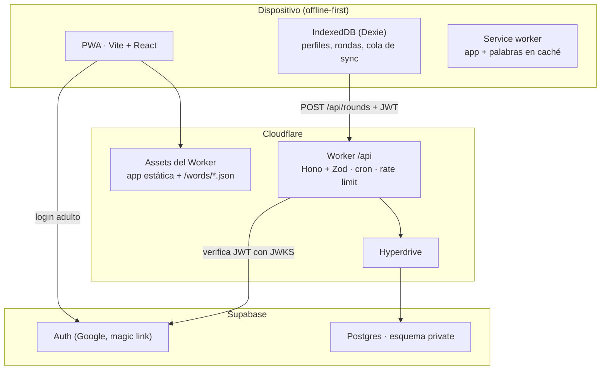

# Arquitectura

## 1. Vista general



- El juego completo corre en el cliente con la lógica de `shared/`. Sin cuenta, el progreso vive solo en IndexedDB.
- Con cuenta, cada ronda terminada se encola y se sube al Worker. El Worker recalcula todo con la misma lógica de `shared/` y su resultado manda.
- La PWA y la API están en el mismo dominio: **un solo Worker** sirve la app estática (`assets` de wrangler, con `app/dist`) y responde `/api/*` (`run_worker_first`). Sin CORS ni rutas que configurar. Antes se pensaba en Pages + un Worker aparte; Cloudflare unificó ambos en Workers con assets estáticos.

## 2. Stack

| Capa | Elección | Notas |
| --- | --- | --- |
| Lenguaje | TypeScript estricto en todo | `strict: true`, `noUncheckedIndexedAccess: true` |
| Monorepo | npm workspaces | `app`, `api`, `shared`, `words` |
| Node | 22 LTS | `.nvmrc` |
| App | React 19 + Vite 7 | SPA |
| Estilos | Tailwind CSS v4 con `@tailwindcss/vite` | Reemplaza el CDN actual |
| Ruteo | React Router 7 (modo librería) | Rutas: `/`, `/mapa`, `/mundo/:id`, `/mundo/:id/leccion`, `/ronda`, `/tienda`, `/coleccion`, `/progreso`, `/perfil`, `/nuevo-perfil`, `/entrar-al-aula`, `/adultos` (login y paneles de familia y docente), `/aula/:id` (tablero) |
| Estado de UI | Zustand | Estado de la ronda en curso |
| Datos locales | Dexie + `dexie-react-hooks` | IndexedDB |
| PWA | `vite-plugin-pwa` 1.x (Workbox, `generateSW`) | Precache del shell, las fuentes (solo el subconjunto latin) y `/words/*.json`. Actualización con aviso (`registerType: 'prompt'`): la versión nueva se activa cuando el chico toca "Actualizar", nunca durante una ronda o una lección. Íconos generados desde `app/public/icon.svg` con `npm run icons -w app`. |
| Validación | Zod (`zod/mini`) | Esquemas compartidos en `shared/`. La variante mini tiene la misma validación con menos peso en el bundle. |
| API | Cloudflare Workers + Hono | `wrangler` |
| Acceso a datos | `postgres` (postgres.js) vía Hyperdrive | SQL explícito, sin ORM |
| JWT | `jose` | JWKS de Supabase Auth (adultos) y HS256 propio (chicos de aula) |
| Login adulto en la app | `@supabase/supabase-js` | Solo Auth (Google y enlace por email). Se carga recién en el área de adultos o al sincronizar un perfil de familia, para no sumarle peso a la app de los chicos. Con `vite --mode localauth` (desarrollo y e2e) hay un login de prueba sin Supabase; el build `production` no lo incluye. |
| Base y login | Supabase (Postgres 15+, Auth) | Migraciones con Supabase CLI |
| Tests | Vitest (+ Testing Library), Playwright para e2e | |
| Calidad | ESLint + Prettier, `tsc --noEmit` | |
| CI | GitHub Actions | typecheck, lint, test, validación del banco, build |

## 3. Estructura del repo

```
gatito-gramatico/
├─ app/                      # PWA
│  ├─ public/
│  │  ├─ words/              # salida del banco (generada, versionada)
│  │  └─ icons/
│  └─ src/
│     ├─ main.tsx, router.tsx
│     ├─ db/                 # Dexie: esquema y repositorios
│     ├─ sync/               # cola y cliente de la API
│     ├─ features/
│     │  ├─ turn/            # pasos tonica / tipo / tilde + feedback
│     │  ├─ round/           # ronda en curso y resultados
│     │  ├─ map/             # mapa de mundos y paradas
│     │  ├─ shop/            # tienda de accesorios y fondos
│     │  ├─ collection/      # gatos amigos e insignias
│     │  ├─ progress/        # progreso por regla
│     │  ├─ notify/          # avisos al ganar algo
│     │  ├─ profile/         # perfiles locales, login adulto
│     │  └─ classroom/       # tablero docente
│     ├─ components/         # UI genérica (Button, Gatita, AdSlot…)
│     └─ content/            # textos de la gatita
├─ api/                      # Cloudflare Worker
│  ├─ src/
│  │  ├─ index.ts            # Hono app + cron
│  │  ├─ auth.ts             # verificación de JWT
│  │  ├─ db.ts               # conexión Hyperdrive + consultas
│  │  └─ routes/             # rounds, profiles, classrooms
│  └─ wrangler.toml
├─ shared/                   # lógica pura, sin DOM ni red
│  └─ src/
│     ├─ types.ts
│     ├─ schemas.ts          # Zod: contratos de la API y del banco
│     ├─ data/               # worlds, collection.json, badges.json
│     └─ engine/             # config, turn, scoring, leitner, mastery,
│                            # round, worlds, rewards, badges, rng, ruleTexts
├─ words/                    # banco de palabras
│  ├─ src/                   # world-XX.txt (fuente editable)
│  ├─ data/                  # lexicón es_AR y frecuencias
│  ├─ lib/                   # motor de acentuación + parser + tests
│  ├─ scripts/               # build, validate, check-lexicon.py
│  └─ bank/                  # world-XX.json + index.json (generados)
├─ supabase/
│  ├─ migrations/
│  └─ seed.sql
└─ docs/
```

Regla de dependencias: `app` y `api` importan de `shared`; `shared` no importa de nadie. `words` genera archivos que consume `app`.

## 4. Modelo de datos local (IndexedDB)

Base Dexie `gatita`, versión 2 (la 2 agrega `purchases`):

| Tabla | Clave | Campos |
| --- | --- | --- |
| `profiles` | `id` (uuid) | `alias`, `avatar`, `kind: 'guest' \| 'linked'`, `link?: { via: 'family', accountId } \| { via: 'classroom', classroomId, token }` (con qué se sincroniza: la sesión del adulto o el token del chico), `createdAt`, `sound` (sonido y vibración), `look?: { accesorio?, fondo? }` (lo que tiene puesto) |
| `rounds` | `id` (uuid) | `profileId`, `world`, `stop`, `kind: 'practice' \| 'boss' \| 'lesson'`, `startedAt`, `finishedAt`, `tzOffsetMin`, `wordsVersion`, `turns: TurnResult[]`, `synced: boolean` |
| `profileState` | `profileId` | `state: ProfileState` (de `shared/engine`: cajas por palabra, EMA por regla y mundo, progreso de mundos, XP, croquetas, racha, insignias, colección), `updatedAt` |
| `purchases` | `id` (uuid) | `profileId`, `itemId`, `at`, `synced: boolean` (desde la versión 2) |
| `meta` | `key` | `activeProfileId`, `wordsVersion` |

- `purchases` es el otro registro fuente: las compras de la tienda. No entran en `replay`; el saldo y los ítems salen de `wallet(state, purchases)` (especificación §8.3).
- `rounds` es el registro fuente. `profileState` es derivado y se guarda entero, con el mismo shape que `profile_state.state` en el servidor (§5): se puede reconstruir aplicando `shared/engine` a las rondas en orden de `finishedAt` (función `replay(rounds) → state`). Esto se usa para tests, migraciones y para aplicar la respuesta del servidor.

## 5. Modelo de datos remoto (Postgres)

Todo en el esquema `private`. Los roles `anon` y `authenticated` no tienen ningún permiso sobre él; solo el usuario que usa el Worker.

```sql
create schema private;

create table private.accounts (          -- adulto: familia o docente
  id uuid primary key,                   -- = auth.users.id
  role text not null check (role in ('family','teacher')),
  display_name text,
  created_at timestamptz not null default now()
);

create table private.classrooms (
  id uuid primary key default gen_random_uuid(),
  teacher_id uuid not null references private.accounts(id),
  name text not null,
  code text not null unique,             -- 6 letras, sin ambiguas (sin 0/O, 1/I)
  created_at timestamptz not null default now()
);

create table private.profiles (           -- un chico
  id uuid primary key,                   -- generado en el cliente
  owner_id uuid references private.accounts(id),
  classroom_id uuid references private.classrooms(id),
  alias text not null,
  avatar text not null,
  pin_hash text,                         -- solo si entra por aula
  created_at timestamptz not null default now(),
  check (owner_id is not null or classroom_id is not null)
);

create table private.rounds (
  id uuid primary key,                   -- generado en el cliente: idempotencia
  profile_id uuid not null references private.profiles(id),
  world smallint not null,
  stop smallint not null,
  kind text not null check (kind in ('practice','boss','lesson')),
  started_at timestamptz not null,
  finished_at timestamptz not null,
  words_version text not null,
  tz_offset_min smallint not null,      -- para la racha en la hora del dispositivo
  received_at timestamptz not null default now()
);

create table private.turns (
  round_id uuid not null references private.rounds(id) on delete cascade,
  idx smallint not null,
  word_id text not null,
  steps jsonb not null,                  -- [{step, correct}]
  full_correct boolean not null,
  hinted boolean not null,
  challenge boolean not null,
  ms integer not null,
  primary key (round_id, idx)
);

create table private.purchases (         -- compras de la tienda (especificación §8.3)
  id uuid primary key,                   -- generado en el cliente: idempotencia
  profile_id uuid not null references private.profiles(id),
  item_id text not null,
  at timestamptz not null,
  received_at timestamptz not null default now(),
  unique (profile_id, item_id)
);

create table private.profile_state (      -- derivado, recalculable
  profile_id uuid primary key references private.profiles(id),
  state jsonb not null,                  -- mismo shape que el estado local
  rounds_played integer not null,
  updated_at timestamptz not null default now()
);

create table private.teacher_unlocks (
  classroom_id uuid references private.classrooms(id),
  world smallint not null,
  primary key (classroom_id, world)
);

create table private.join_attempts (      -- respaldo del rate limit
  ip_hash text not null,
  at timestamptz not null default now()
);

alter table private.accounts enable row level security;
-- … RLS habilitado en todas, sin políticas para anon/authenticated (deny all)
revoke all on schema private from anon, authenticated;
```

- Rol `gatita_worker`: el único con permisos sobre `private` (más una política de RLS propia en cada tabla). Se crea sin contraseña en la migración; `npm run setup:db -w api` le genera una aleatoria, la aplica y crea o actualiza Hyperdrive con ella: no se muestra ni se guarda en otro lado. La conexión de administrador que usa el script está en `.env.local` (no versionado).
- `profile_state.state` guarda el estado derivado completo (cajas, EMA, progreso) para responder rápido. Si cambia la lógica, se recalcula con `replay` desde `rounds` + `turns`.
- Índices: `rounds(profile_id, finished_at)`, `turns(word_id)`, `profiles(classroom_id)`, `classrooms(teacher_id)` y único `profiles(classroom_id, lower(alias))`: un apodo no se repite dentro de un aula, porque apodo + PIN identifica al chico.

## 6. API (Worker)

Base: `/api`. Todas las rutas, salvo `classrooms/join`, requieren `Authorization: Bearer <token>`: el JWT de Supabase de un adulto o el token de perfil de un chico de aula (firma con el JWKS del proyecto, emisor `<SUPABASE_URL>/auth/v1`, audiencia `authenticated`). Entradas validadas con los esquemas Zod de `shared/src/api.ts`. Código en `api/src`: `app.ts` (rutas), `sync.ts` (recepción y recálculo), `db.ts` (SQL), `auth.ts` (JWT de Supabase), `secrets.ts` (token de perfil, PIN e IP), `index.ts` (fetch, assets y cron).

| Método y ruta | Quién | Qué hace |
| --- | --- | --- |
| `POST /api/accounts/me` | adulto | Crea o devuelve la cuenta (`role`). |
| `GET /api/profiles` | adulto | Perfiles del adulto (familia) o de sus aulas (docente). |
| `POST /api/profiles` | familia | Crea un perfil o vincula uno invitado: `{ id, alias, avatar, createdAt?, rounds? }`. Si trae `rounds`, se importan como en `POST /rounds`. `createdAt` es el alta del perfil invitado (nunca en el futuro). Un apodo no se repite dentro de la misma cuenta (409). |
| `DELETE /api/profiles/:id` | familia dueña | Borra el perfil con todo su progreso (rondas, turnos, compras y estado, en cascada). Desde el panel de familia, con confirmación. |
| `POST /api/rounds` | dueño del perfil | Sube una o más rondas: `{ profileId, rounds: Round[] }`. Idempotente por `round.id`. Recalcula y devuelve `{ state, acceptedIds, rejected: [{ id, reason }] }`: cada ronda se acepta o rechaza por separado. |
| `POST /api/purchases` | dueño del perfil | Sube compras: `{ profileId, purchases: Purchase[] }`. Idempotente por `id`. Acepta solo las que pasan `purchaseProblem` con el estado recalculado; devuelve `{ acceptedIds, rejected }`. |
| `GET /api/profiles/:id/state` | dueño del perfil (adulto o el propio chico) | `{ state, rounds, purchases, profile }`, para un dispositivo nuevo: el estado y los registros fuente. Con `?only=state`, solo el estado (para traer cambios del servidor). |
| `GET /api/classrooms` | docente | Sus aulas: nombre, código, cantidad de alumnos y mundos abiertos. |
| `POST /api/classrooms` | docente | `{ name }` → crea un aula con un código de 6 letras al azar (sin I ni O; si ya existe, prueba otro). |
| `POST /api/classrooms/join` | público, con rate limit | `{ code, alias, pin, avatar?, profileId?, createdAt? }` → si el apodo ya existe en el aula (sin distinguir mayúsculas), comprueba el PIN y devuelve su token (`existing: true`, para traerlo a otro dispositivo); si no, crea el perfil (con el id del perfil invitado del dispositivo, si viene) y devuelve su token. |
| `GET /api/classrooms/:id/dashboard` | docente del aula | Por alumno: apodo, mundo actual, rondas, última actividad, EMA e intentos por regla y estrellas por mundo. Lee solo esas partes del estado guardado. |
| `POST /api/classrooms/:id/unlocks` | docente del aula | `{ world }` → abre ese mundo para el aula. Abrir un mundo solo marca `unlocked` (`applyTeacherUnlocks`): se aplica sobre el estado guardado de cada alumno, sin recalcular sus rondas, y también en cada estado que devuelve la API. |

**Chicos que entran por aula** no tienen cuenta de Supabase. `classrooms/join` devuelve un **token de perfil** firmado por el Worker (JWT HS256, `sub = profileId`, vence a los 90 días). El Worker acepta ambos tipos de token: el de Supabase (adulto) y el de perfil (chico), y verifica permisos según el tipo: un chico solo sube y lee su propio perfil; no ve aulas, cuentas ni otros perfiles.

**Secreto del Worker (`APP_SECRET`, `wrangler secret`):** de él se derivan claves distintas (HMAC con una etiqueta por uso) para firmar los tokens de perfil, para el hash del PIN y para el de la IP. Lo crea `npm run setup:secret -w api` y no se cambia: los PIN guardados dependen de él.

**Validaciones de `POST /api/rounds`:**

- Máximo 20 rondas por request, máximo 11 turnos por ronda (1 de lección: 3). Los límites están en `CONFIG.api`.
- Forma: `RoundSchema` (sin campos de más; el jefe es la parada 5 y la lección la 1; `full` tiene que coincidir con los pasos y la pista, no se puede declarar un acierto).
- Si la ronda viene con la versión actual del banco, cada `wordId` tiene que existir. Con una versión vieja no se rechaza: las palabras que ya no están se ignoran al aplicar (§8). Inventar ids no da nada, porque `applyRound` ignora las palabras que no conoce.
- Un `id` de ronda que ya es de otro perfil se rechaza; uno que ya es del mismo perfil se acepta sin duplicar (idempotencia).
- `ms` por turno entre 300 y 600 000.
- `finished_at` no en el futuro (tolerancia 5 min) ni anterior al alta del perfil.
- Una ronda de jefe solo se acepta si el jefe estaba habilitado según el estado recalculado; si no, se guarda pero no da desbloqueos.

- Cada subida bloquea la fila del perfil (`select … for update`) y recalcula con `replay` sobre todas sus rondas: el resultado no depende del orden en que lleguen.

**Cron diario:** `SELECT 1` contra la base para que el plan gratis de Supabase no pause el proyecto.

**Rate limit:** binding de Rate Limiting de Workers: 10 intentos por minuto por IP en `classrooms/join` (`JOIN_LIMITER`); 60 por minuto por perfil en `rounds` y `purchases`. El ingreso al aula además cuenta los intentos en `join_attempts` (por hash de la IP, ventana de `CONFIG.classroom.joinWindowMin`): el 11.º intento del minuto se rechaza aunque el binding no esté (desarrollo, tests). El cron borra los intentos de más de un día.

**Recálculo incremental:** al recibir rondas, si todas son posteriores a la última guardada (lo normal), se aplican sobre el estado guardado; si llega alguna anterior, se recalcula con `replay`. Da el mismo resultado y gasta mucho menos CPU (el plan gratis de Workers tiene 10 ms por pedido).

## 7. Sincronización

1. Al terminar una ronda, el cliente la guarda en `rounds` con `synced: false` y actualiza el estado local con `shared/engine`.
2. Si el perfil está vinculado y hay red, se envían todas las rondas pendientes en orden. Después, las compras pendientes (`purchases` con `synced: false`); el servidor las valida con el estado ya actualizado.
3. El servidor responde con `state` y `acceptedIds`. El cliente marca esas rondas como `synced`, reemplaza el estado local por `state` y vuelve a aplicar encima las rondas que sigan pendientes (si se jugó algo mientras viajaba la request).
4. Reintentos sin red, con 429 o con 5xx: 2 s, 4 s, 8 s… hasta 5 minutos (`CONFIG.syncBackoff`). Una ronda o compra que el servidor rechaza queda marcada con `rejected` y el motivo, se reporta en consola y no se reintenta. Sin token (perfil no vinculado o sesión vencida) no se intenta.
5. Se sincroniza al abrir la app, al volver la red (`online`) y al terminar una ronda, una lección o una compra. El inicio muestra un indicador discreto ("Todo guardado en la nube" o cuántas faltan subir).
6. Si no había nada para subir, se pide `GET /state?only=state` y se aplican encima las rondas pendientes: así llegan los cambios del servidor (un mundo abierto por el docente, rondas jugadas en otro dispositivo).
7. Al traer un perfil a un dispositivo nuevo (familia: "Jugar acá"; chico de aula: mismo apodo y PIN), `GET /state` completo: se guardan sus rondas y compras como sincronizadas y su estado como estado inicial.
8. Token de cada perfil vinculado: el de la sesión del adulto en ese dispositivo (familia) o el token de perfil guardado en el perfil (aula).

La misma función `applyRound(state, round, words, config)` corre en el cliente y en el Worker. Es determinista: no usa `Date.now()` ni azar (las fechas vienen en la ronda).

## 8. Banco de palabras en la app

- `app/public/words/index.json` lista los mundos (nombre, tema, archivo, cantidad por tier) y la `version` del banco. Es una copia de `words/bank/` que hace el build.
- `world-XX.json` se carga bajo demanda al entrar a un mundo y para armar repasos. El service worker los precachea todos (son livianos).
- `meta.wordsVersion` guarda la versión con la que se jugó; cada ronda la lleva.
- Si una palabra deja de existir en una versión nueva, sus cajas se ignoran (no se borran).

## 9. Seguridad

1. Esquema `private` sin permisos para `anon` ni `authenticated`: la clave pública de Supabase no permite leer nada.
2. El Worker verifica el JWT (firma con JWKS de Supabase o con el secreto de perfil, `exp`, `aud`).
3. Autorización por recurso: un adulto solo toca sus perfiles; un docente solo sus aulas; un token de perfil solo su perfil.
4. Zod en cada entrada.
5. Cajas, XP, desbloqueos y premios se recalculan en el servidor.
6. RLS habilitado en todas las tablas sin políticas permisivas (segunda línea).
7. PIN de aula guardado con hash, nunca en claro: HMAC-SHA256 con una clave derivada del secreto del Worker, sobre aula + apodo + PIN. Con 4 dígitos hay solo 10 000 combinaciones: un hash lento (`scrypt`) no protege si se filtra la base (se prueban todas en segundos) y además excede el límite de CPU de Workers. Lo que protege es el secreto, que no está en la base. Rate limit en el ingreso (11 intentos por minuto y por IP, bloqueado). La IP tampoco se guarda: solo su hash.
8. Secretos solo en el Worker (`wrangler secret`): cadena de Hyperdrive, secreto de tokens de perfil. El cliente solo conoce la URL de Supabase y la clave pública, para el login adulto.
9. Datos personales mínimos: los chicos nunca dan email ni nombre real. El alias se valida (largo 2–20, sin URLs ni números de teléfono).
10. Sin Gemini ni otras claves en el bundle. CI busca patrones de claves (`AIza`, `sk-`, `eyJ` largos) en `app/dist` y falla si encuentra.

## 10. Entornos

| Entorno | App | API | Base |
| --- | --- | --- | --- |
| Local | `npm run dev -w app` (Vite) | `npm run dev:local` (las rutas del Worker sobre Node) | PGlite en `.local-db/`, mismas migraciones; sin Docker |
| Producción | Worker `--env production`, con la app; lo publica GitHub Actions al mergear a `main` | idem | El único proyecto de Supabase en la nube; migraciones con `npm run db:push` antes de mergear |

No hay un proyecto de Supabase de desarrollo: las pruebas se hacen en local sobre PGlite (o con `supabase start` si hace falta probar Auth). El CI no tiene la conexión a la base: solo el token de Cloudflare para publicar.

Tests del Worker: `npm test -w api` levanta Postgres embebido (PGlite) con las migraciones reales y llama a la API con tokens firmados en el test. No hace falta Docker. Pasos para probar en local, crear el proyecto y publicar: [puesta-en-marcha.md](puesta-en-marcha.md).

En local, Vite hace proxy de `/api` a `wrangler dev`.

## 11. Monitoreo de errores

- **Worker:** `app.onError` escribe un JSON (`type: 'worker-error'`, método, ruta, mensaje, primeras líneas del stack) en los logs de Cloudflare (`observability` activado en `wrangler.jsonc`).
- **App:** en el build `production`, los errores que nadie atrapó y los de render (pantalla de error de React Router) se mandan a `POST /api/errors` (público, 30 por minuto por IP, `ERRORS_LIMITER`). El Worker los escribe en los mismos logs (`type: 'client-error'`) y no guarda nada en la base. El reporte lleva el mensaje y el stack recortados, sin URLs con parámetros, emails ni tokens; la ruta va sin ids; y la versión (commit en el CI). Máximo 5 reportes por carga de página.
- Sin servicios externos de rastreo: es un sitio para chicos. Los logs se ven en el panel de Cloudflare (*Workers & Pages → gatita-gramatica → Logs*).

## 12. Revisión del banco por docentes

- `/revision` (desde el panel docente): cada palabra con sílabas, tónica, tipo, tilde, regla, tier, trampa y frase. Cada adulto marca las que hay que revisar, con una nota (`private.word_reviews`: una marca por adulto y palabra).
- `GET/POST /api/reviews`, `DELETE /api/reviews/:wordId` (adulto con cuenta; solo ve sus marcas).
- `npm run reviews:export` (con la conexión de `.env.local`) baja `revisiones.local.csv`: palabra, clasificación, cuántos la marcaron y sus notas. Las correcciones se hacen en `words/src/*.txt`.

## 13. Accesibilidad

- Contraste AA: sobre el fondo rosado, `pink-500/600/700` y `gray-400/500` de Tailwind se oscurecen un tono en `@theme` (`app/src/index.css`).
- Foco visible en toda la app (`:focus-visible`). En el turno, cada paso lleva el foco a la consigna (lector de pantalla y teclado); en la corrección, al botón "Seguir". Las sílabas se anuncian con su posición.
- "Letra más grande" por perfil: agranda la letra base del documento (todo está en `rem`).
- Los e2e corren axe (WCAG 2.1 A y AA) en todas las pantallas.

## 14. Publicidad (al final, detrás de una bandera)

- Componente `<AdSlot>` con alto reservado; solo en inicio y resultados, nunca durante una ronda.
- Siempre con `data-tag-for-age-treatment="1"` (sitio dirigido a menores: sin anuncios personalizados).
- Bandera `VITE_ADS_ENABLED` (más `VITE_ADSENSE_CLIENT` y los slots); apagada por defecto y desactivada para perfiles de aula. Componente `app/src/components/AdSlot.tsx`. Antes de activarla: revisar la configuración de AdSense para sitios dirigidos a menores y actualizar la política de privacidad.
