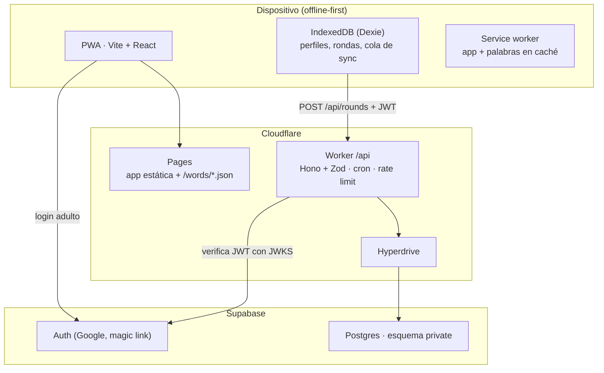

# Arquitectura

## 1. Vista general



- El juego completo corre en el cliente con la lógica de `shared/`. Sin cuenta, el progreso vive solo en IndexedDB.
- Con cuenta, cada ronda terminada se encola y se sube al Worker. El Worker recalcula todo con la misma lógica de `shared/` y su resultado manda.
- La PWA y la API están en el mismo dominio (`/api/*` enrutado al Worker): sin CORS.

## 2. Stack

| Capa | Elección | Notas |
| --- | --- | --- |
| Lenguaje | TypeScript estricto en todo | `strict: true`, `noUncheckedIndexedAccess: true` |
| Monorepo | npm workspaces | `app`, `api`, `shared`, `words` |
| Node | 22 LTS | `.nvmrc` |
| App | React 19 + Vite 7 | SPA |
| Estilos | Tailwind CSS v4 con `@tailwindcss/vite` | Reemplaza el CDN actual |
| Ruteo | React Router 7 (modo librería) | Rutas: `/`, `/mapa`, `/mundo/:id`, `/mundo/:id/leccion`, `/ronda`, `/tienda`, `/coleccion`, `/progreso`, `/perfil`, `/aula/:id` |
| Estado de UI | Zustand | Estado de la ronda en curso |
| Datos locales | Dexie + `dexie-react-hooks` | IndexedDB |
| PWA | `vite-plugin-pwa` 1.x (Workbox, `generateSW`) | Precache del shell, las fuentes (solo el subconjunto latin) y `/words/*.json`. Actualización con aviso (`registerType: 'prompt'`): la versión nueva se activa cuando el chico toca "Actualizar", nunca durante una ronda o una lección. Íconos generados desde `app/public/icon.svg` con `npm run icons -w app`. |
| Validación | Zod (`zod/mini`) | Esquemas compartidos en `shared/`. La variante mini tiene la misma validación con menos peso en el bundle. |
| API | Cloudflare Workers + Hono | `wrangler` |
| Acceso a datos | `postgres` (postgres.js) vía Hyperdrive | SQL explícito, sin ORM |
| JWT | `jose` | JWKS de Supabase Auth |
| Base y login | Supabase (Postgres 15+, Auth) | Migraciones con Supabase CLI |
| Tests | Vitest (+ Testing Library), Playwright para e2e | |
| Calidad | ESLint + Prettier, `tsc --noEmit` | |
| CI | GitHub Actions | typecheck, lint, test, validación del banco, build |

## 3. Estructura del repo

```
gatito-gramatico/
├─ app/                      # PWA
│  ├─ public/
│  │  ├─ words/              # salida del banco (generada, versionada)
│  │  └─ icons/
│  └─ src/
│     ├─ main.tsx, router.tsx
│     ├─ db/                 # Dexie: esquema y repositorios
│     ├─ sync/               # cola y cliente de la API
│     ├─ features/
│     │  ├─ turn/            # pasos tonica / tipo / tilde + feedback
│     │  ├─ round/           # ronda en curso y resultados
│     │  ├─ map/             # mapa de mundos y paradas
│     │  ├─ shop/            # tienda de accesorios y fondos
│     │  ├─ collection/      # gatos amigos e insignias
│     │  ├─ progress/        # progreso por regla
│     │  ├─ notify/          # avisos al ganar algo
│     │  ├─ profile/         # perfiles locales, login adulto
│     │  └─ classroom/       # tablero docente
│     ├─ components/         # UI genérica (Button, Gatita, AdSlot…)
│     └─ content/            # textos de la gatita
├─ api/                      # Cloudflare Worker
│  ├─ src/
│  │  ├─ index.ts            # Hono app + cron
│  │  ├─ auth.ts             # verificación de JWT
│  │  ├─ db.ts               # conexión Hyperdrive + consultas
│  │  └─ routes/             # rounds, profiles, classrooms
│  └─ wrangler.toml
├─ shared/                   # lógica pura, sin DOM ni red
│  └─ src/
│     ├─ types.ts
│     ├─ schemas.ts          # Zod: contratos de la API y del banco
│     ├─ data/               # worlds, collection.json, badges.json
│     └─ engine/             # config, turn, scoring, leitner, mastery,
│                            # round, worlds, rewards, badges, rng, ruleTexts
├─ words/                    # banco de palabras
│  ├─ src/                   # world-XX.txt (fuente editable)
│  ├─ data/                  # lexicón es_AR y frecuencias
│  ├─ lib/                   # motor de acentuación + parser + tests
│  ├─ scripts/               # build, validate, check-lexicon.py
│  └─ bank/                  # world-XX.json + index.json (generados)
├─ supabase/
│  ├─ migrations/
│  └─ seed.sql
└─ docs/
```

Regla de dependencias: `app` y `api` importan de `shared`; `shared` no importa de nadie. `words` genera archivos que consume `app`.

## 4. Modelo de datos local (IndexedDB)

Base Dexie `gatita`, versión 2 (la 2 agrega `purchases`):

| Tabla | Clave | Campos |
| --- | --- | --- |
| `profiles` | `id` (uuid) | `alias`, `avatar`, `kind: 'guest' \| 'linked'`, `remoteId?`, `createdAt`, `sound` (sonido y vibración), `look?: { accesorio?, fondo? }` (lo que tiene puesto) |
| `rounds` | `id` (uuid) | `profileId`, `world`, `stop`, `kind: 'practice' \| 'boss' \| 'lesson'`, `startedAt`, `finishedAt`, `tzOffsetMin`, `wordsVersion`, `turns: TurnResult[]`, `synced: boolean` |
| `profileState` | `profileId` | `state: ProfileState` (de `shared/engine`: cajas por palabra, EMA por regla y mundo, progreso de mundos, XP, croquetas, racha, insignias, colección), `updatedAt` |
| `purchases` | `id` (uuid) | `profileId`, `itemId`, `at`, `synced: boolean` (desde la versión 2) |
| `meta` | `key` | `activeProfileId`, `wordsVersion` |

- `purchases` es el otro registro fuente: las compras de la tienda. No entran en `replay`; el saldo y los ítems salen de `wallet(state, purchases)` (especificación §8.3).
- `rounds` es el registro fuente. `profileState` es derivado y se guarda entero, con el mismo shape que `profile_state.state` en el servidor (§5): se puede reconstruir aplicando `shared/engine` a las rondas en orden de `finishedAt` (función `replay(rounds) → state`). Esto se usa para tests, migraciones y para aplicar la respuesta del servidor.

## 5. Modelo de datos remoto (Postgres)

Todo en el esquema `private`. Los roles `anon` y `authenticated` no tienen ningún permiso sobre él; solo el usuario que usa el Worker.

```sql
create schema private;

create table private.accounts (          -- adulto: familia o docente
  id uuid primary key,                   -- = auth.users.id
  role text not null check (role in ('family','teacher')),
  display_name text,
  created_at timestamptz not null default now()
);

create table private.classrooms (
  id uuid primary key default gen_random_uuid(),
  teacher_id uuid not null references private.accounts(id),
  name text not null,
  code text not null unique,             -- 6 letras, sin ambiguas (sin 0/O, 1/I)
  created_at timestamptz not null default now()
);

create table private.profiles (           -- un chico
  id uuid primary key,                   -- generado en el cliente
  owner_id uuid references private.accounts(id),
  classroom_id uuid references private.classrooms(id),
  alias text not null,
  avatar text not null,
  pin_hash text,                         -- solo si entra por aula
  created_at timestamptz not null default now(),
  check (owner_id is not null or classroom_id is not null)
);

create table private.rounds (
  id uuid primary key,                   -- generado en el cliente: idempotencia
  profile_id uuid not null references private.profiles(id),
  world smallint not null,
  stop smallint not null,
  kind text not null check (kind in ('practice','boss','lesson')),
  started_at timestamptz not null,
  finished_at timestamptz not null,
  words_version text not null,
  tz_offset_min smallint not null,      -- para la racha en la hora del dispositivo
  received_at timestamptz not null default now()
);

create table private.turns (
  round_id uuid not null references private.rounds(id) on delete cascade,
  idx smallint not null,
  word_id text not null,
  steps jsonb not null,                  -- [{step, correct}]
  full_correct boolean not null,
  hinted boolean not null,
  challenge boolean not null,
  ms integer not null,
  primary key (round_id, idx)
);

create table private.purchases (         -- compras de la tienda (especificación §8.3)
  id uuid primary key,                   -- generado en el cliente: idempotencia
  profile_id uuid not null references private.profiles(id),
  item_id text not null,
  at timestamptz not null,
  received_at timestamptz not null default now(),
  unique (profile_id, item_id)
);

create table private.profile_state (      -- derivado, recalculable
  profile_id uuid primary key references private.profiles(id),
  state jsonb not null,                  -- mismo shape que el estado local
  rounds_played integer not null,
  updated_at timestamptz not null default now()
);

create table private.teacher_unlocks (
  classroom_id uuid references private.classrooms(id),
  world smallint not null,
  primary key (classroom_id, world)
);

create table private.join_attempts (      -- respaldo del rate limit
  ip_hash text not null,
  at timestamptz not null default now()
);

alter table private.accounts enable row level security;
-- … RLS habilitado en todas, sin políticas para anon/authenticated (deny all)
revoke all on schema private from anon, authenticated;
```

- `profile_state.state` guarda el estado derivado completo (cajas, EMA, progreso) para responder rápido. Si cambia la lógica, se recalcula con `replay` desde `rounds` + `turns`.
- Índices: `rounds(profile_id, finished_at)`, `turns(word_id)`, `profiles(classroom_id)`.

## 6. API (Worker)

Base: `/api`. Todas las rutas, salvo `classrooms/join`, requieren `Authorization: Bearer <JWT de Supabase>`. Entradas y salidas validadas con los esquemas Zod de `shared/src/schemas.ts`.

| Método y ruta | Quién | Qué hace |
| --- | --- | --- |
| `POST /api/accounts/me` | adulto | Crea o devuelve la cuenta (`role`). |
| `GET /api/profiles` | adulto | Perfiles del adulto (familia) o de sus aulas (docente). |
| `POST /api/profiles` | adulto | Crea un perfil o vincula uno invitado: `{ id, alias, avatar, rounds? }`. Si trae `rounds`, se importan. |
| `POST /api/rounds` | dueño del perfil | Sube una o más rondas: `{ profileId, rounds: Round[] }`. Idempotente por `round.id`. Recalcula y devuelve `{ state, acceptedIds }`. |
| `POST /api/purchases` | dueño del perfil | Sube compras: `{ profileId, purchases: Purchase[] }`. Idempotente por `id`. Acepta solo las que pasan `purchaseProblem` con el estado recalculado; devuelve `{ acceptedIds }`. |
| `GET /api/profiles/:id/state` | dueño del perfil | Estado completo y compras, para un dispositivo nuevo. |
| `POST /api/classrooms` | docente | Crea un aula y devuelve el código. |
| `POST /api/classrooms/join` | público, con rate limit | `{ code, alias, pin }` → crea o recupera el perfil y devuelve un token de perfil. |
| `GET /api/classrooms/:id/dashboard` | docente del aula | Por perfil y por regla: EMA, intentos, mundo actual, última actividad. |
| `POST /api/classrooms/:id/unlocks` | docente del aula | `{ world }` → abre ese mundo para el aula. |

**Chicos que entran por aula** no tienen cuenta de Supabase. `classrooms/join` devuelve un **token de perfil** firmado por el Worker (JWT HS256 con secreto propio, `sub = profileId`, vence a los 90 días). El Worker acepta ambos tipos de token: el de Supabase (adulto) y el de perfil (chico), y verifica permisos según el tipo.

**Validaciones de `POST /api/rounds`:**

- Máximo 20 rondas por request, máximo 11 turnos por ronda (1 de lección: 3).
- Cada `wordId` existe en el banco de la `words_version` informada (el Worker lleva un índice de ids por versión).
- `ms` por turno entre 300 y 600 000.
- `finished_at` no en el futuro (tolerancia 5 min) ni anterior al alta del perfil.
- Una ronda de jefe solo se acepta si el jefe estaba habilitado según el estado recalculado; si no, se guarda pero no da desbloqueos.

**Cron diario:** `SELECT 1` contra la base para que el plan gratis de Supabase no pause el proyecto.

**Rate limit:** binding de Rate Limiting de Workers: 10 intentos por minuto por IP en `classrooms/join`; 60 por minuto por perfil en `rounds`.

## 7. Sincronización

1. Al terminar una ronda, el cliente la guarda en `rounds` con `synced: false` y actualiza el estado local con `shared/engine`.
2. Si el perfil está vinculado y hay red, se envían todas las rondas pendientes en orden. Después, las compras pendientes (`purchases` con `synced: false`); el servidor las valida con el estado ya actualizado.
3. El servidor responde con `state` y `acceptedIds`. El cliente marca esas rondas como `synced`, reemplaza el estado local por `state` y vuelve a aplicar encima las rondas que sigan pendientes (si se jugó algo mientras viajaba la request).
4. Reintentos con backoff ante error de red; un 4xx de validación marca la ronda como rechazada y se reporta en consola (no se reintenta).
5. Al abrir la app en un dispositivo nuevo con un perfil vinculado: `GET /state` y se usa como estado inicial.

La misma función `applyRound(state, round, words, config)` corre en el cliente y en el Worker. Es determinista: no usa `Date.now()` ni azar (las fechas vienen en la ronda).

## 8. Banco de palabras en la app

- `app/public/words/index.json` lista los mundos (nombre, tema, archivo, cantidad por tier) y la `version` del banco. Es una copia de `words/bank/` que hace el build.
- `world-XX.json` se carga bajo demanda al entrar a un mundo y para armar repasos. El service worker los precachea todos (son livianos).
- `meta.wordsVersion` guarda la versión con la que se jugó; cada ronda la lleva.
- Si una palabra deja de existir en una versión nueva, sus cajas se ignoran (no se borran).

## 9. Seguridad

1. Esquema `private` sin permisos para `anon` ni `authenticated`: la clave pública de Supabase no permite leer nada.
2. El Worker verifica el JWT (firma con JWKS de Supabase o con el secreto de perfil, `exp`, `aud`).
3. Autorización por recurso: un adulto solo toca sus perfiles; un docente solo sus aulas; un token de perfil solo su perfil.
4. Zod en cada entrada.
5. Cajas, XP, desbloqueos y premios se recalculan en el servidor.
6. RLS habilitado en todas las tablas sin políticas permisivas (segunda línea).
7. PIN de aula guardado con hash (`scrypt` vía WebCrypto/`@noble/hashes`), nunca en claro. Rate limit en el ingreso.
8. Secretos solo en el Worker (`wrangler secret`): cadena de Hyperdrive, secreto de tokens de perfil. El cliente solo conoce la URL de Supabase y la clave pública, para el login adulto.
9. Datos personales mínimos: los chicos nunca dan email ni nombre real. El alias se valida (largo 2–20, sin URLs ni números de teléfono).
10. Sin Gemini ni otras claves en el bundle. CI busca patrones de claves (`AIza`, `sk-`, `eyJ` largos) en `app/dist` y falla si encuentra.

## 10. Entornos

| Entorno | App | API | Base |
| --- | --- | --- | --- |
| Local | `npm run dev -w app` (Vite) | `wrangler dev` | `supabase start` (Docker) |
| Preview | Pages preview por PR | Worker `env.preview` | Proyecto Supabase de desarrollo |
| Producción | Pages | Worker | Proyecto Supabase de producción |

En local, Vite hace proxy de `/api` a `wrangler dev`.

## 11. Publicidad (al final, detrás de una bandera)

- Componente `<AdSlot>` con alto reservado; solo en inicio y resultados, nunca durante una ronda.
- Siempre con `data-tag-for-age-treatment="1"` (sitio dirigido a menores: sin anuncios personalizados).
- Bandera `VITE_ADS_ENABLED`; desactivado para perfiles de aula.
